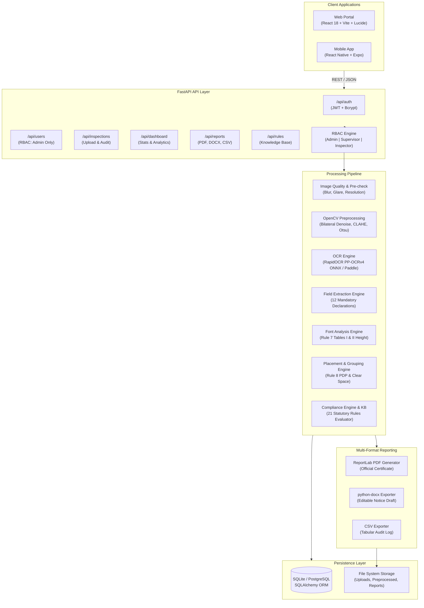

# SafeMetric – Technical Architecture & Statutory Compliance Specification

> **System:** SafeMetric (Legal Metrology Compliance System)  
> **Statutory Foundations:** Legal Metrology Act, 2009 (Act No. 1 of 2010) & Legal Metrology (Packaged Commodities) Rules, 2011 (G.S.R. 202(E))  
> **Edition:** SIH26034 Automated Optical Inspection Compliance Specification  

---

## 1. System Architecture Diagram



---

## 2. Component Breakdown

| Subsystem | Technology | Responsibility |
| :--- | :--- | :--- |
| **Web Frontend** | React 18, Vite, Lucide Icons, Axios | Responsive dashboard, live scan/upload with dimension calibration, interactive bounding box evidence viewer, rule breakdown tables, role-based user management, multi-format export. |
| **Mobile Frontend** | React Native, Expo, React Navigation | Field officer interface with camera capture, real-time inspection, evidence review, and format selection modal. |
| **API Gateway** | FastAPI, Uvicorn, Pydantic v2 | High-throughput async REST API, payload validation, multipart file intake, secure token management, HTTP exceptions. |
| **Access Control (RBAC)** | PyJWT, Passlib (Bcrypt), FastAPI Depends | Hierarchical authorization (`Admin` > `Supervisor` > `Inspector`). Restricts destructive operations, user management, and system-wide analytics. |
| **Computer Vision (CV)** | OpenCV (`cv2`), NumPy, Pillow | Surface quality assessment (Laplacian variance for blur, luminance histogram for glare), CLAHE contrast enhancement, bilateral filtering, perspective handling. |
| **Optical Text Recognition** | RapidOCR (PP-OCRv4 ONNX Runtime), PaddleOCR | Optical polygon detection, character extraction, bounding boxes, optical confidence scores per token. |
| **Field Extraction** | Custom Regex & Pattern Parsing Engine | Extracts 12 mandatory statutory declarations without hardcoding test brands: generic name, net quantity, MRP, unit sale price, date, manufacturer name & address, consumer care, origin. |
| **Font Size Analysis** | FontAnalysisEngine (`font_analysis.py`) | Estimates character height in mm using user-calibrated dimensions (confidence: 0.95) or statistical packaging tier heuristics (confidence: 0.60). Audits compliance against Rule 7 Tables I & II. |
| **Declaration Placement** | PlacementChecker (`placement_checker.py`) | Assesses PDP spatial clustering of core declarations (Rule 8(1)-(2)) and verifies statutory clear space surrounding net quantity (1x height vertically, 2x height horizontally). |
| **Statutory Rules Engine** | LegalRuleKnowledgeBase (`knowledge_base.py`), ComplianceEngine | Strict 4-verdict evaluator (`PASS`, `FAIL`, `NEEDS_REVIEW`, `NOT_APPLICABLE`). Evaluates 21 statutory rules under LMA 2009 and PCR 2011. |
| **Multi-Format Reporting** | ReportLab, python-docx, Python CSV | Produces immutable PDF certificates, editable Microsoft Word (.docx) reports with sign-off blocks, and flat CSV audit sheets. |
| **Persistence** | SQLAlchemy 2.0, SQLite (PostgreSQL compatible) | ACID-compliant storage for users, inspections, extracted fields, rules metadata, and reports. |

---

## 3. End-to-End Data Flow Pipeline

```
[Packaged Commodity Image Captured / Uploaded]
                       │
                       ▼
┌────────────────────────────────────────────────────────────────────────┐
│ 1. QUALITY & SURFACE CHECK (quality_service.py)                        │
│    • Laplacian variance blur threshold (focus check)                   │
│    • Luminance histogram glare analysis                                │
│    • Resolution & aspect ratio validation                              │
└──────────────────────┬─────────────────────────────────────────────────┘
                       │
                       ▼
┌────────────────────────────────────────────────────────────────────────┐
│ 2. OPENCV PREPROCESSING (preprocessing.py)                             │
│    • Grayscale conversion & Bilateral noise reduction                  │
│    • CLAHE adaptive contrast optimization                              │
│    • Otsu binarization and thresholding for crisp character edges      │
└──────────────────────┬─────────────────────────────────────────────────┘
                       │
                       ▼
┌────────────────────────────────────────────────────────────────────────┐
│ 3. OPTICAL CHARACTER RECOGNITION (ocr_service.py)                      │
│    • RapidOCR PP-OCRv4 ONNX model execution                            │
│    • Optical polygon extraction [[x1,y1], [x2,y2], [x3,y3], [x4,y4]]    │
│    • Line-by-line token confidence computation                         │
└──────────────────────┬─────────────────────────────────────────────────┘
                       │
                       ▼
┌────────────────────────────────────────────────────────────────────────┐
│ 4. FIELD EXTRACTION & GEOMETRIC AUDIT                                  │
│    • field_extractor.py: Maps raw text + boxes to 12 declarations      │
│    • font_analysis.py: Scale resolution (mm/px) & Rule 7 character mm  │
│    • placement_checker.py: PDP grouping & Rule 8 net qty clear zone    │
└──────────────────────┬─────────────────────────────────────────────────┘
                       │
                       ▼
┌────────────────────────────────────────────────────────────────────────┐
│ 5. STATUTORY COMPLIANCE ENGINE (compliance_engine.py)                  │
│    • Knowledge Base query: 21 statutory rules evaluated                │
│    • 4-verdict determination: PASS | FAIL | NEEDS_REVIEW | N/A         │
│    • Uncertainty routing (<80% conf or missing boxes -> NEEDS_REVIEW)  │
│    • Weighted compliance score computation                             │
└──────────────────────┬─────────────────────────────────────────────────┘
                       │
                       ▼
┌────────────────────────────────────────────────────────────────────────┐
│ 6. MULTI-FORMAT REPORT GENERATION & PERSISTENCE                        │
│    • PDF generation via ReportLab (immutable signed certificate)       │
│    • DOCX generation via python-docx (editable notice draft)           │
│    • CSV export for tabular departmental analysis                      │
│    • Database persistence of inspection, fields, violations, & audit   │
└────────────────────────────────────────────────────────────────────────┘
```

---

## 4. Statutory Rule Mapping (PCR 2011 & LMA 2009)

The system encodes 21 statutory rules directly from official Gazette notifications (G.S.R. 202(E) dated 7 March 2011):

| # | Rule ID | Legal Reference | Statutory Requirement | SafeMetric Validation Method |
| :-: | :--- | :--- | :--- | :--- |
| **1** | `LMA-2009-SEC-18-MANDATORY` | Section 18(1), LMA 2009 read with Rule 4, PCR 2011 | Pre-packaged commodities must bear core statutory declarations. | Verifies presence of at least 4 core declarations (name, qty, date, MRP, mfg). |
| **2** | `LMA-2009-SEC-36-DEEMED-MFG` | Section 36(1) & Section 49, LMA 2009 | Deemed manufacturer liability attaches to brand owner/marketer. | Identifies manufacturer, packer, or marketer entity name. |
| **3** | `PCR-2011-R6-1-A-MFG-NAME` | Rule 6(1)(a) & Rule 10(1)-(2), PCR 2011 | Name of manufacturer, packer, or importer must be declared. | Validates non-empty entity name and qualifier ("Mfg by", "Marketed by", etc.). |
| **4** | `PCR-2011-R6-1-A-ADDR` | Rule 6(1)(a) & Rule 10(1) Explanation | Complete postal address with city, state, and pin code. | Checks address structure for postal identifiers, city/state presence. |
| **5** | `PCR-2011-R6-1-B-GENERIC-NAME` | Rule 6(1)(b), PCR 2011 | Generic or common name of commodity must be prominently declared. | Ensures commodity identity is extracted with >= 80% optical confidence. |
| **6** | `PCR-2011-R6-1-C-NET-QUANTITY` | Rule 6(1)(c), Rule 11(1), Rule 12(1) | Standard net quantity in metric units of weight, measure, or count. | Validates metric units (g, kg, ml, l), numeral presence, and bounds. |
| **7** | `PCR-2011-R12-6-PROHIBITED-QUALIFIERS` | Rule 12(6), PCR 2011 | Prohibits misleading qualifiers ("approx", "about", "minimum", "average"). | Regex inspection of net quantity string for banned qualifier tokens. |
| **8** | `PCR-2011-R13-UNITS-SYMBOLS` | Rule 13(1)-(5), PCR 2011 | Prescribed SI symbols (g, kg, ml, l, m, cm). Prohibits non-metric units. | Verifies correct unit symbol capitalization and SI standardization. |
| **9** | `PCR-2011-R6-1-D-DATE` | Rule 6(1)(d) & Rule 6(1)(g), PCR 2011 | Month and year of manufacture, packing, or import (MM/YYYY). | Regex parsing for standard month/year date formats. |
| **10** | `PCR-2011-R6-1-E-MRP` | Rule 6(1)(e), Rule 2(m), PCR 2011 & Sec 18 | Maximum Retail Price declared as "MRP Rs. ... / ₹ ..." incl. of all taxes. | Verifies currency symbol (₹ / Rs.), numeric price, and "(incl. of all taxes)". |
| **11** | `PCR-2011-R6-1-EA-USP` | Rule 6(1)(ea) & Rule 6(11), PCR 2011 | Unit Sale Price (per g/kg/ml/l/piece) when net qty > 100g/ml. | Checks presence of USP declaration or computes statutory benchmark. |
| **12** | `PCR-2011-R6-1-AB-COUNTRY-ORIGIN` | Rule 6(1)(ab) & Rule 10(1) Second Proviso | Country of origin must be declared on all imported and domestic goods. | Detects origin country tokens ("Made in India", "Country of Origin: ..."). |
| **13** | `PCR-2011-R6-2-CONSUMER-CARE` | Rule 6(2), PCR 2011 | Consumer care identity with telephone, email, and postal address. | Verifies presence of phone number, email address, or designated office contact. |
| **14** | `PCR-2011-R6-3-STICKER-RESTRICTION` | Rule 6(3) & Rule 6(4), PCR 2011 | Alteration of declared MRP by sticker overlay is strictly prohibited. | Assesses optical edges and label continuity for sticker alteration evidence. |
| **15** | `PCR-2011-R5-SECOND-SCHEDULE` | Rule 5 read with Second Schedule, PCR 2011 | Commodities in Second Schedule must be packed in prescribed quantities. | Audits commodity against Second Schedule standard pack sizes or disclaimer. |
| **16** | `PCR-2011-THIRD-SCHEDULE-WHEN-PACKED` | Rule 11(4) read with Third Schedule, PCR 2011 | "When Packed" net quantity qualification restricted to specified goods. | Ensures "when packed" is strictly limited to Third Schedule goods (e.g. soaps). |
| **17** | `PCR-2011-R9-LEGIBILITY-CONTRAST-LANG` | Rule 9(1) & Rule 9(4), PCR 2011 | Declarations must be legible, contrasting, and in Hindi or English. | Computes average optical contrast score and English/Devanagari script presence. |
| **18** | `PCR-2011-R26-STATUTORY-EXEMPTIONS` | Rule 26 & Rule 3, PCR 2011 | Exemption for small packages (<= 10g / 10ml) or institutional packages. | Applies statutory exemption logic, marking non-applicable rules appropriately. |
| **19** | `PCR-2011-R7-PHYSICAL-MEASUREMENT` | Rule 7 & First Schedule Advisory | Maximum Permissible Error (MPE) and physical weights advisory. | System-level advisory routing net weight verification to physical scale tools. |
| **20** | `PCR-2011-R7-FONT-SIZE-COMPLIANCE` | Rule 7(1)-(3) read with Tables I & II, PCR 2011 | Minimum character height in mm (Table I: 1mm/2mm/4mm; Table II; general 1mm). | Scales box height to mm using calibration or tier heuristic; evaluates heights. |
| **21** | `PCR-2011-R8-DECLARATION-PLACEMENT` | Rule 8(1) & 8(2), PCR 2011 | Core declarations grouped on PDP; net quantity clear space (1x vert, 2x horiz). | Evaluates PDP cluster bounding box and checks text intrusions in clear zone. |

---

## 5. Role-Based Access Control (RBAC) Matrix

| Capability / Endpoint | Field Inspector | Supervisor | Administrator |
| :--- | :---: | :---: | :---: |
| **Create Inspection (`POST /api/inspections/upload`)** | Yes | Yes | Yes |
| **Run Optical Analysis (`POST /api/inspections/analyze`)** | Yes | Yes | Yes |
| **View Own Inspection Records (`GET /api/inspections`)** | Yes | Yes | Yes |
| **Download Reports (PDF / DOCX / CSV)** | Yes | Yes | Yes |
| **Update Own Profile (`PUT /api/profile`)** | Yes | Yes | Yes |
| **Access Department-wide Analytics (`GET /api/dashboard/stats`)** | Own Only | Yes | Yes |
| **Access All Officers' Inspections (`GET /api/inspections`)** | Own Only | Yes | Yes |
| **Manage User Accounts & Roles (`GET/PUT /api/users`)** | No | No | Yes |
| **Delete Inspection Records (`DELETE /api/inspections/{id}`)** | No | No | Yes |
| **Delete User Accounts (`DELETE /api/users/{id}`)** | No | No | Yes |

---

## 6. Local Setup & Deployment Framework

### Prerequisites
- Python 3.10+ (tested on Python 3.12 64-bit)
- Node.js 18+ & npm
- SQLite3 or PostgreSQL 14+

### Backend Setup
```bash
cd backend
python -m venv venv
venv\Scripts\activate          # Windows PowerShell: .\venv\Scripts\Activate.ps1
pip install -r requirements.txt
python app/main.py            # Starts server on http://localhost:8000
```

### Web Setup
```bash
cd web
npm install
npm run dev                   # Starts Vite dev server on http://localhost:5173
```

### Mobile Setup
```bash
cd mobile
npm install
npx expo start                # Launches Expo Developer Tools
```

### Verification & Testing Suite
```bash
cd backend
python test_rules_knowledge_base.py   # Audits all 21 statutory rules
python test_compliance_engine.py       # Audits 14 compliance engine workflows
python test_font_analysis.py           # Audits Rule 7 character heights & scale
python test_placement_checker.py       # Audits Rule 8 PDP grouping & clear space
python test_report_exporter.py         # Audits DOCX & CSV generation
python test_rbac.py                    # Audits Role-Based Access Control
```
