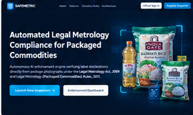
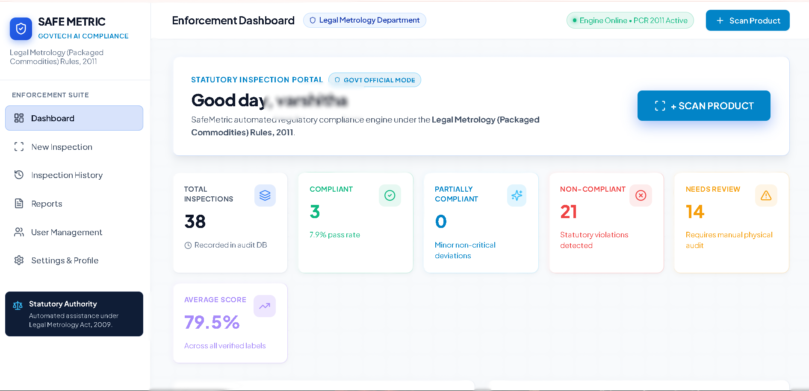
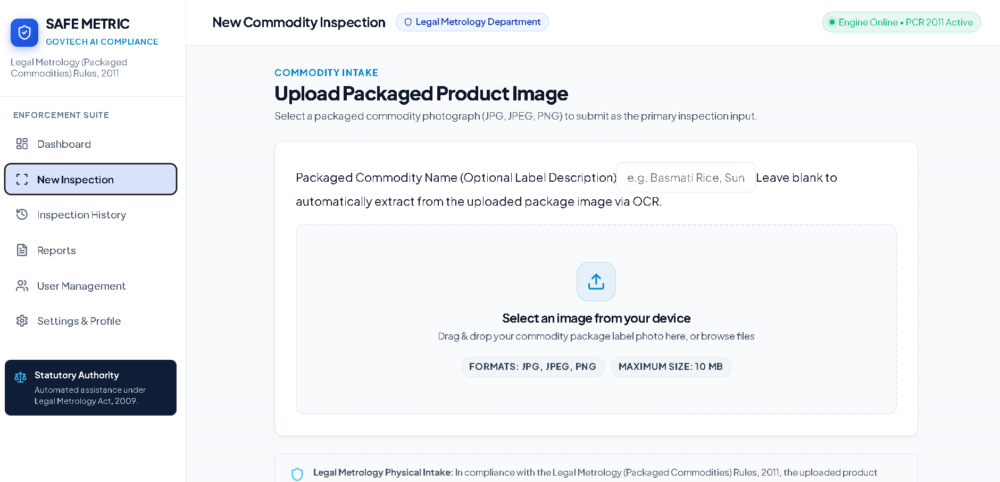
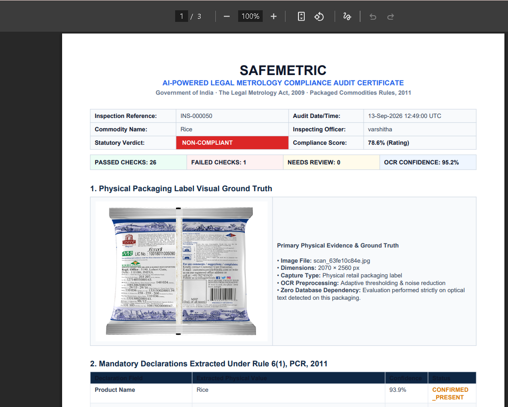
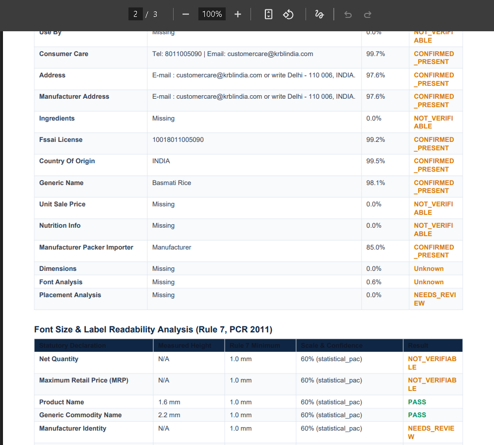
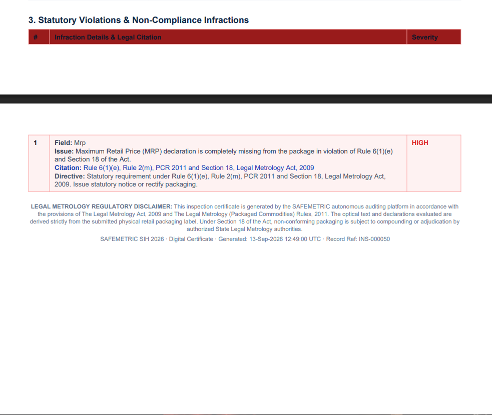
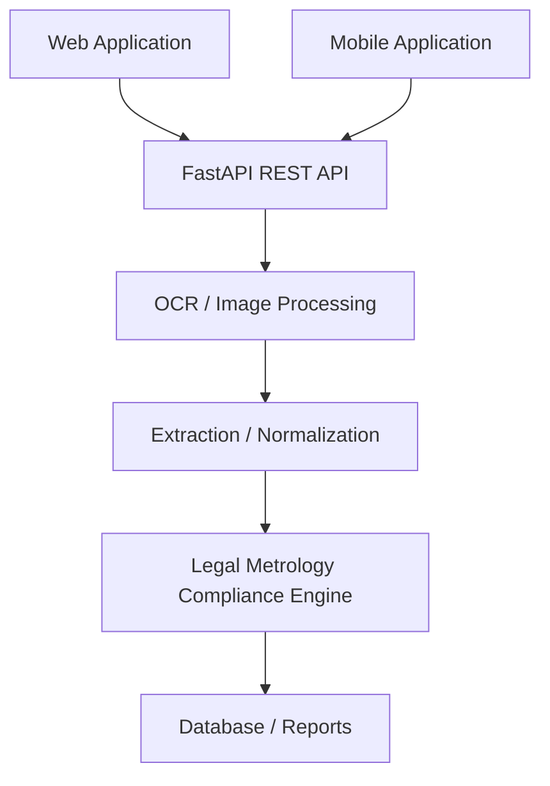

# 🛡️ SafeMetric

## AI-Powered Legal Metrology Compliance System

> Scan. Validate. Trust.


SafeMetric is an AI-powered regulatory compliance system designed to assist inspection workflows for packaged commodity label declarations using OCR, computer vision, statutory rule validation, and structured reporting.

[](https://www.python.org/)
[](https://fastapi.tiangolo.com/)
[](https://react.dev/)
[](https://reactnative.dev/)
[](https://expo.dev/)
[](https://www.sqlite.org/)

> **Team Name:** SAFE METRIC  
> **Tagline:** Scan. Validate. Trust.  
> **Statutory Basis:** Legal Metrology Act, 2009 & Legal Metrology (Packaged Commodities) Rules, 2011 (G.S.R. 202(E))  
> **Architecture Reference:** See [ARCHITECTURE.md](ARCHITECTURE.md) for full technical design, pipeline diagrams, and statutory matrices.

## 📚 Contents

- [Overview](#overview)
- [Problem](#problem)
- [Solution](#solution)
- [How It Works](#-how-safemetric-works)
- [Key Features](#-key-features)
- [Application Preview](#-application-preview)
- [System Architecture](#-system-architecture)
- [Compliance & Statutory Capabilities](#-compliance--statutory-capabilities)
- [Tech Stack](#-tech-stack)
- [Project Structure](#-project-structure)
- [Setup](#-setup)
- [Demo Accounts](#-demo-accounts--rbac-roles)
- [SIH Judge Demo](#-sih-judge-demo--under-3-minutes)
- [Future Enhancements](#-future-enhancements)
- [Disclaimer](#-disclaimer)

---

## Overview

**SafeMetric** is an enterprise-grade AI-powered regulatory compliance system built for enforcement officers, inspectors, and supervisors under the Department of Consumer Affairs. It automates the optical inspection of packaged commodities by capturing or uploading product labels, extracting declarations using OpenCV computer vision and OCR, validating declarations against 21 statutory Legal Metrology rules, detecting infractions, generating multi-format export certificates (PDF, DOCX, CSV), and maintaining an auditable inspection history with Role-Based Access Control (RBAC).

### Core Product Principle & Terminology Mandate
> [!IMPORTANT]
> SafeMetric evaluates **PACKAGED PRODUCT LABEL DECLARATION COMPLIANCE**. It does **NOT** evaluate consumable, physical, or medical safety.
>
> **Standard Statutory Terminology:**
> - `COMPLIANT`
> - `NON-COMPLIANT`
> - `PARTIALLY COMPLIANT`
> - `REVIEW REQUIRED`
> - `MISSING DECLARATION`
> - `INVALID DECLARATION`
> - `LOW OCR CONFIDENCE`
>
> *Prohibited Phrasing:* "Product is safe", "Guaranteed safe". The system provides automated compliance assistance; final regulatory determination remains subject to physical inspection by an authorized officer.

## 🚀 At a Glance

| Capability | Description |
|---|---|
| 🔍 OCR | Extract declarations from package labels |
| ⚖️ Compliance | Evaluate configured Legal Metrology rules |
| 📐 Rule 7 | Font size/readability analysis |
| 📍 Rule 8 | Declaration placement/clear-space analysis |
| 📊 Analytics | Inspection and compliance insights |
| 📄 Reports | PDF, DOCX and CSV exports |
| 👮 RBAC | Admin, Supervisor and Inspector roles |
| 📱 Mobile | React Native + Expo inspection workflow |

## Problem

Packaging declarations are often inconsistent, difficult to verify manually, and subject to legal scrutiny under the Legal Metrology Act and rules. Inspectors need an auditable, repeatable way to assess declarations on product labels without relying on manual reading alone.

## Solution

SafeMetric combines image capture, OCR extraction, spatial analysis, statutory rule validation, and role-aware reporting into a single inspection workflow. It supports both web and mobile inspection workflows while preserving a documented evidentiary trail for compliance decisions.

## 🔄 How SafeMetric Works

```text
📷 CAPTURE / UPLOAD
      ↓
🔍 OCR & EXTRACTION
      ↓
🧠 DECLARATION ANALYSIS
      ↓
⚖️ STATUTORY RULE VALIDATION
      ↓
🚨 VIOLATION DETECTION
      ↓
📊 COMPLIANCE ASSESSMENT
      ↓
📄 INSPECTION REPORT
```

## ✨ Key Features

### 🔍 Intelligent Label Inspection
Image-based package label inspection and OCR extraction for field officers and supervisors.

### ⚖️ Statutory Rule Validation
Evaluation against the configured Legal Metrology rule catalog, with rule-specific severity and reporting.

### 📐 Rule 7 Analysis
Font-size and readability analysis using the existing implementation and physical measurement logic.

### 📍 Rule 8 Analysis
Declaration placement and clear-space analysis for the Principal Display Panel and net quantity zone.

### 📄 Multi-Format Reports
PDF, DOCX and CSV export capabilities for statutory records and audit workflows.

### 👮 Role-Based Access Control
Admin → Supervisor → Inspector hierarchy with scoped visibility and protected administrative actions.

### 🧾 Evidence & Audit Trail
Inspection records retain evidence, analysis details, and report outputs for review and accountability.

## 📸 Application Preview

Explore the key interfaces of SafeMetric, from the landing experience
and inspection workflow to compliance results and multi-page reporting.

### 🏠 Landing Page



*SafeMetric landing page introducing the AI-powered Legal Metrology
compliance platform.*

---

### 📊 Enforcement Dashboard



*Dashboard providing inspection statistics, compliance insights,
violations and recent inspection activity.*

---

### 🔍 New Inspection



*Inspection workflow for uploading or capturing a packaged commodity
label and initiating compliance analysis.*

---

### 📄 Inspection Reports

The report interface/output spans multiple pages, so use all three
report screenshots together.







*Multi-page statutory inspection report generated by SafeMetric.*

## 🏗️ System Architecture

SafeMetric consists of two unified client applications powered by a single shared FastAPI backend.



## ⚖️ Compliance & Statutory Capabilities

### Key Statutory Capabilities (SIH26034 Compliance)
1. **Rule 7 Font Size & Readability Analysis**: Calculates physical character height in millimeters from OCR bounding polygons using either user-calibrated dimensions (confidence: 0.95) or statistical packaging tier heuristics (confidence: 0.60). Audits compliance against Rule 7(1)-(3) Tables I & II (area-dependent minimum character heights).
2. **Rule 8 Declaration Placement & Clear Space**: Evaluates Principal Display Panel (PDP) spatial clustering for core declarations (net quantity, MRP, manufacturer, consumer care, date) and verifies statutory clear space surrounding the net quantity numeral (1x character height vertically, 2x character height horizontally) under Rule 8(1) Proviso.
3. **Multi-Format Statutory Report Exporter**: Produces immutable publication-grade PDF certificates via ReportLab, editable Microsoft Word (`.docx`) statutory inspection notices with officer sign-off blocks via `python-docx`, and flat tabular CSV audit records.
4. **Hierarchical Role-Based Access Control (RBAC)**: Secure access tiering (`Admin` > `Supervisor` > `Inspector`). Enforces department-wide analytics visibility for supervisors/admins, restricts record deletion and user role management to administrators, and scopes field inspectors to their own inspections.

### Legal Metrology Rules Implemented (21 Statutory Rules)

All 21 rules are directly encoded from the Legal Metrology Act, 2009 and the Legal Metrology (Packaged Commodities) Rules, 2011 (G.S.R. 202(E)):

| # | Rule ID | Legal Reference | Statutory Requirement | Severity |
|:--:|:---|:---|:---|:---:|
| 1 | `LMA-2009-SEC-18-MANDATORY` | Section 18(1), LMA 2009 | Minimum mandatory declarations present on pre-packaged commodity | HIGH |
| 2 | `LMA-2009-SEC-36-DEEMED-MFG` | Section 36(1) & 49, LMA 2009 | Deemed manufacturer liability attribution | HIGH |
| 3 | `PCR-2011-R6-1-A-MFG-NAME` | Rule 6(1)(a) & Rule 10(1)-(2) | Complete name of manufacturer, packer, or importer | HIGH |
| 4 | `PCR-2011-R6-1-A-ADDR` | Rule 6(1)(a) & Rule 10(1) Exp | Complete factory or registered postal address | HIGH |
| 5 | `PCR-2011-R6-1-B-GENERIC-NAME` | Rule 6(1)(b), PCR 2011 | Generic or common name of the commodity | HIGH |
| 6 | `PCR-2011-R6-1-C-NET-QUANTITY` | Rule 6(1)(c), Rule 11 & 12 | Standard net quantity in SI metric units (g, kg, ml, l) | HIGH |
| 7 | `PCR-2011-R12-6-PROHIBITED-QUALIFIERS` | Rule 12(6), PCR 2011 | Prohibition of misleading qualifiers ("approx", "about", "minimum") | HIGH |
| 8 | `PCR-2011-R13-UNITS-SYMBOLS` | Rule 13(1)-(5), PCR 2011 | Prescribed SI unit symbols and capitalization | MEDIUM |
| 9 | `PCR-2011-R6-1-D-DATE` | Rule 6(1)(d) & Rule 6(1)(g) | Month and year of manufacture, packing, or import (MM/YYYY) | HIGH |
| 10 | `PCR-2011-R6-1-E-MRP` | Rule 6(1)(e) & Rule 2(m) | Maximum Retail Price with currency (₹ / Rs.) and "incl. of all taxes" | HIGH |
| 11 | `PCR-2011-R6-1-EA-USP` | Rule 6(1)(ea) & Rule 6(11) | Unit Sale Price per g/kg/ml/l when net quantity > 100g/ml | MEDIUM |
| 12 | `PCR-2011-R6-1-AB-COUNTRY-ORIGIN` | Rule 6(1)(ab) & Rule 10(1) | Country of Origin statement on all commodities | HIGH |
| 13 | `PCR-2011-R6-2-CONSUMER-CARE` | Rule 6(2), PCR 2011 | Consumer Care grievance phone, email, and postal contact | HIGH |
| 14 | `PCR-2011-R6-3-STICKER-RESTRICTION` | Rule 6(3) & Rule 6(4) | Prohibition of price alteration by sticker overlay | HIGH |
| 15 | `PCR-2011-R5-SECOND-SCHEDULE` | Rule 5 & Second Schedule | Standard packaging size compliance for scheduled commodities | MEDIUM |
| 16 | `PCR-2011-THIRD-SCHEDULE-WHEN-PACKED` | Rule 11(4) & Third Schedule | "When Packed" net quantity qualification restricted to specified goods | MEDIUM |
| 17 | `PCR-2011-R9-LEGIBILITY-CONTRAST-LANG` | Rule 9(1) & Rule 9(4) | Declarations prominent, legible, contrasting, in Hindi or English | MEDIUM |
| 18 | `PCR-2011-R26-STATUTORY-EXEMPTIONS` | Rule 26 & Rule 3 | Statutory exemptions for small (<= 10g/ml) or institutional packs | LOW |
| 19 | `PCR-2011-R7-PHYSICAL-MEASUREMENT` | Rule 7 & First Schedule | Maximum Permissible Error (MPE) physical weight advisory | LOW |
| 20 | `PCR-2011-R7-FONT-SIZE-COMPLIANCE` | Rule 7(1)-(3), Tables I & II | Character/numeral height in mm relative to package surface area | HIGH |
| 21 | `PCR-2011-R8-DECLARATION-PLACEMENT` | Rule 8(1)-(2), PCR 2011 | Grouping on Principal Display Panel; clear space around net quantity | HIGH |

## 🔍 OCR / Computer Vision Pipeline

SafeMetric applies a structured pipeline to raw label images before rule evaluation:

- Image capture or upload from web or mobile inspection flows
- OpenCV preprocessing for denoising, contrast adjustment, and edge refinement
- OCR extraction for declaration fields and polygon coordinate capture
- Normalization of values, units, and text variants
- Rule 7 physical measurement analysis using calibrated or heuristic package dimensions
- Rule 8 declaration placement and clear-space grouping checks
- Final compliance determination and report generation

## 👮 RBAC

SafeMetric pre-seeds three demo accounts across the role hierarchy for testing and jury demonstrations:

| Role | Email | Password | Scope & Permissions |
|:---|:---|:---|:---|
| **Admin** | `officer@safemetric.gov.in` | `password123` | Full system access: delete inspections, manage user accounts & assign roles (`GET/PUT /api/users`), view all records & analytics. |
| **Supervisor** | `supervisor@safemetric.gov.in` | `password123` | Department-wide analytics (`GET /api/dashboard/stats`), view all officers' inspections, cannot delete records or manage users. |
| **Inspector** | `inspector@safemetric.gov.in` | `password123` | Field officer: upload/scan commodities, view personal inspections & stats, download reports (PDF/DOCX/CSV). |

*The Web login screen features a 1-click **"Fill Demo Officer Credentials"** button.*

## 📄 Reporting

The reporting layer exports inspection outcomes in multiple formats for evidence, review, and archival use:

- PDF certificates with publication-ready formatting
- DOCX notices for editable statutory documentation
- CSV audit exports for spreadsheet analysis and review
- Download access scoped through the authenticated officer workflow

## 📁 Project Structure

<details>
<summary>📁 Repository structure</summary>

```text
safemetric/
├── ARCHITECTURE.md
├── README.md
├── backend/
│   ├── app/
│   │   ├── main.py
│   │   ├── database.py
│   │   ├── demo_seeder.py
│   │   ├── models/
│   │   ├── schemas/
│   │   ├── routers/
│   │   ├── services/
│   │   ├── auth/
│   │   ├── ocr/
│   │   ├── extraction/
│   │   ├── rules/
│   │   └── reports/
│   ├── uploads/
│   ├── reports/
│   ├── demo_samples/
│   ├── requirements.txt
│   ├── test_rules_knowledge_base.py
│   ├── test_compliance_engine.py
│   ├── test_font_analysis.py
│   ├── test_placement_checker.py
│   ├── test_report_exporter.py
│   └── test_rbac.py
├── web/
│   ├── src/
│   ├── package.json
│   └── vite.config.js
├── mobile/
│   ├── src/
│   ├── App.js
│   ├── app.json
│   └── package.json
└── demo_samples/
```

</details>

## 🧩 Tech Stack

| Layer | Technology |
|---|---|
| Frontend | React + Vite |
| Backend | FastAPI |
| Database | SQLite / SQLAlchemy |
| OCR | Existing OCR implementation |
| Computer Vision | OpenCV |
| Mobile | React Native + Expo |
| Reporting | ReportLab / python-docx / CSV |
| Authentication | Existing JWT / bcrypt implementation |

## 🔧 Setup

### 1. Shared Backend (FastAPI)

```bash
cd backend

python -m venv venv

# Windows:
venv\Scripts\activate
# Linux/macOS:
source venv/bin/activate

pip install -r requirements.txt
pip install -r requirements-dev.txt

python -m uvicorn app.main:app --host 127.0.0.1 --port 8000 --reload
```

*Backend API Docs (Swagger):* `http://127.0.0.1:8000/docs`

### 2. Web Application (React + Vite)

```bash
cd web
npm install
npm run dev
```

*Web App URL:* `http://localhost:5173`

### 3. Mobile Application (React Native / Expo)

```bash
cd mobile
npm install
npx expo start
```

**Testing on Different Targets:**
- **Android Emulator:** Press `a` in the Expo terminal.
- **Physical Device:** Use Expo Go on the same Wi‑Fi network.
- **Web Browser:** Press `w` to test the mobile UI in-browser.

## 🧪 Verification & Test Suites

The backend includes automated verification suites covering statutory evaluation, font analysis, placement checks, export generation, and RBAC validation:

```bash
cd backend
pip install -r requirements-dev.txt
python test_rules_knowledge_base.py
python test_compliance_engine.py
python test_font_analysis.py
python test_placement_checker.py
python test_report_exporter.py
python test_rbac.py
```

## 🎯 SIH Judge Demo — Under 3 Minutes

1. **Open SafeMetric Web** (`http://localhost:5173`).
2. **Login as Administrator:** Click *"Fill Demo Officer Credentials"* (`officer@safemetric.gov.in`) → Click *"Login to SafeMetric"*.
3. **Dashboard:** Review KPIs, compliance rate, violations breakdown, and recent activity.
4. **Initiate Scan:** Click **`+ SCAN PRODUCT`** and optionally enter package dimensions.
5. **Demonstrate Compliant Commodity:**
   - Choose **`✓ SafeRice (Compliant)`** or upload `sample_saferice.png`.
   - Click **`ANALYZE PRODUCT COMPLIANCE`**.
   - Observe OCR extraction, Rule 7 analysis, Rule 8 placement check, and statutory validation.
   - Result status should show `COMPLIANT` with zero violations.
6. **Multi-Format Report Export:**
   - Download PDF, DOCX, and CSV outputs from the result screen.
7. **Demonstrate Non-Compliant Commodity:**
   - Scan next commodity and select **`✕ Crispy Wafers (Non-Compliant)`**.
   - Review violations such as missing consumer care, misleading net quantity text, and missing currency symbol.
8. **Role-Based Access Control & User Management:**
   - Navigate to **User Management** as Admin.
   - Change roles across Inspector, Supervisor, and Admin.
   - Compare History access and delete permissions between Admin and Inspector.

## 🛣️ Future Enhancements

These are planned future capabilities and are not represented as currently implemented features:

- Expanded commodity coverage
- Improved evidence visualization
- Advanced inspection analytics
- Enhanced mobile field workflows
- More robust image-quality handling
- Expanded rule coverage

## ⚠️ Disclaimer

> SafeMetric is a technology-assisted inspection and compliance support system. Final regulatory determinations remain subject to applicable statutory requirements and physical inspection by authorized personnel.

## 👥 Team / SIH 2026

**SAFE METRIC** is designed around a field-inspection workflow for packaged commodity review, with a focus on statutory declaration compliance, rule-specific evidence, and auditable reporting.

---

## 10. Known Limitations & Roadmap

- **Multi-Angle Stitching:** Cylindrical packaging (bottles, cans) currently requires flat-label presentation; future releases will support panorama cylindrical unrolling.
- **Multilingual Recognition:** Support for regional Indian official languages (Hindi, Tamil, Marathi, Bengali, Telugu) under the 8th Schedule.
- **Central Regulatory Registry:** Integration with the National Consumer Helpline (NCH) and e-Daakhil consumer grievance portals.

---

## 11. API Reference Summary

| Method | Endpoint | Access | Description |
|:---|:---|:---|:---|
| `POST` | `/api/auth/login` | Public | Authenticates officer and returns JWT bearer token |
| `POST` | `/api/auth/register` | Public | Registers new field officer (default role: `Inspector`) |
| `GET` | `/api/users` | Admin | Lists all registered users and their assigned roles |
| `PUT` | `/api/users/{id}/role` | Admin | Updates role of a specific user (`Admin`, `Supervisor`, `Inspector`) |
| `DELETE` | `/api/users/{id}` | Admin | Deletes user account (prevents self-deletion) |
| `POST` | `/api/inspections/upload` | Any Officer | Uploads commodity image with optional package dimensions (`package_length_mm`, `package_width_mm`) |
| `POST` | `/api/inspections/analyze` | Any Officer | Executes optical extraction, font analysis, placement check, and rule validation |
| `GET` | `/api/inspections` | Any Officer | Lists inspections (Inspectors see own; Supervisors/Admins see all) |
| `GET` | `/api/inspections/{id}` | Any Officer | Retrieves full inspection details with font and placement audit |
| `DELETE` | `/api/inspections/{id}` | Admin | Permanently deletes an inspection record |
| `GET` | `/api/dashboard/stats` | Any Officer | Retrieves analytics KPIs (Supervisors/Admins see department-wide stats) |
| `GET` | `/api/reports/{id}/download` | Any Officer | Downloads report with format query parameter: `?format=pdf`, `?format=docx`, or `?format=csv` |
| `GET` | `/api/rules` | Any Officer | Catalogs all 21 statutory Legal Metrology rules with citations |

